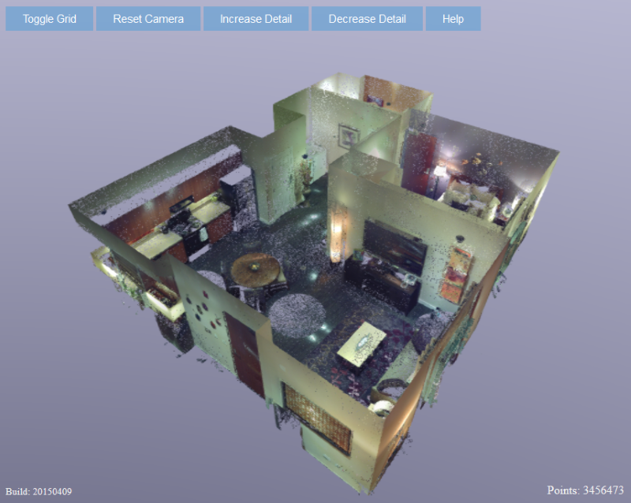

# PointCloud-WebGL
A web viewer for point cloud data. 

This project includes the basic html5/WebGL framework, including scripts and shaders, to display point cloud data, as well as a C++ tool to create hierarchical octree data from an initial point cloud. 

## MakeOctree
MakeOctree creates an octree from a single ASCII XYZ point cloud. The tool splits the tree recursively until each node contains no more than a fixed set of points. Each intermediate node also stores a fixed number of points thus enabling mip mapping. During splitting, the contents of each node are shuffled therefore approximating a uniform sampling of the points even at lower mip resolutions.

## Webviewer
The Webviewer takes full advantage of WebGL and HTML5. Visibility in the octree is determined through view-frustum culling. A visible list keeps track of all visible nodes. Multiple separate threads keep reloading new nodes from the server if they are in the list and have not been loaded yet. 

Interactive frame rates are maintained by progressively rendering octants and points. Once camera movement stops, the view fills in and converges to the right solution. All points are rendered into a fixe-size frame buffer render target. This overcomes some issues how different browsers handle non-double buffered contexts. Finally, the resulting image is up-scaled (or downscaled depending on resolution) and displayed using FXAA to smoothen the result.

The resulting image looks something like this: 

## Why point clouds?
WebGL and mesh rendering is becoming well supported on the web (eg through Unity3D or on thingyverse). Our research lab (the Living Environments Lab<http://wid.wisc.edu/research/lel/>) is interested in point cloud rendering, especially point clouds captured through LiDAR scanners or photogrammetry. This allows us to capture environments at a very high detail level. Meshing (creating triangles) usually destroys some detail and sometimes creates some sub-optimal solutions. Keeping the points in 'raw' format avoids these problems. However, rendering points is a bit more tricky than rendering triangles.

## Why this release? 
This project could be seen as a reference or example implementation on how to implement a web-based pointcloud viewer. 